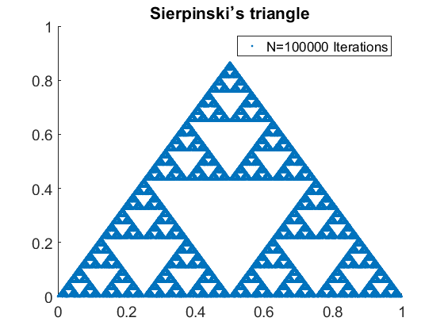

[](http://quantlet.de/)

## [](http://quantlet.de/) **Scaling_Sierpinski** [](http://quantlet.de/)

```yaml

Name of Quantlet: Scaling_Sierpinski

Published in: Metis

Description: 'Sierpinski plots the Sierpinski triangle'

Keywords: scaling, topology, self-similar, mandelbrot, triangle, Sierpinski

See also: Stable_Kelly_Rescaling, Stable_Kelly_LogDensityFinancials, Stable_Kelly_MomentDistribution
Author: NW


Submitted: 2019-12-29

Datafile:


Example: 1.png, sierp.png

```




### MATLAB Code
```matlab

%% Sierpinski
% Source: https://www.mathworks.com/matlabcentral/answers/2180-plotting-sierpinski-s-triangle

%% Global commands

% ver % verify the version of Matlab
clear;clc; % clear

% set global commands for font size and line width
size_font=14;
size_line=2;
set(0,'DefaultAxesFontSize',size_font,'DefaultTextFontSize',size_font);
set(0,'defaultlinelinewidth',size_line)

%% Code

clf
hold on
N=100000;
x=zeros(1,N);y=x;
for a=2:N
    c=randi([0 2]);    
    switch c
        case 0    
            x(a)=0.5*x(a-1);
            y(a)=0.5*y(a-1);
        case 1
            x(a)=0.5*x(a-1)+.25;
            y(a)=0.5*y(a-1)+sqrt(3)/4;
        case 2
            x(a)=0.5*x(a-1)+.5;
            y(a)=0.5*y(a-1);
        end
end
plot(x,y,'.')
title('Sierpinski’s triangle')
legend(sprintf('N=%d Iterations',N))
```

automatically created on 2020-01-15